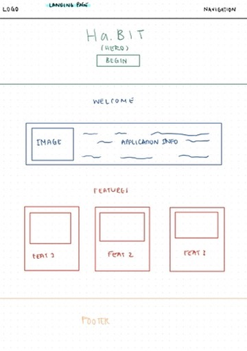
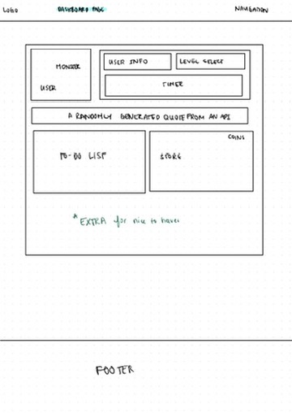
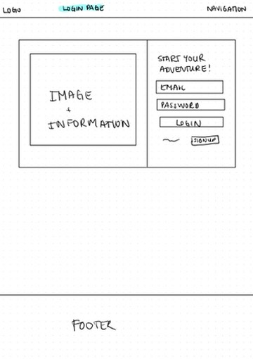
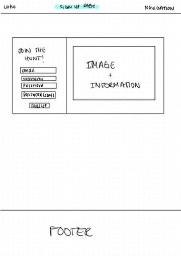
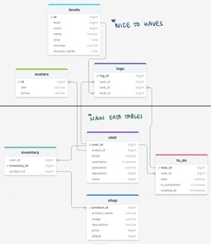
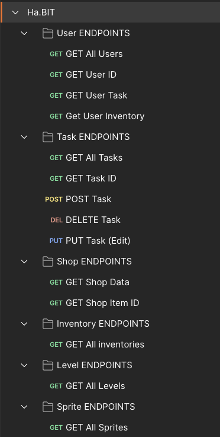

# Overview
Ha.BIT is a gamified productivity app designed to help users manage their tasks efficiently while having fun. By completing tasks and engaging with various levels, users earn coins that can be spent in the in-app shop to customize their characters.

## Problem
Many people struggle with productivity and task management due to a lack of motivation and engagement. Traditional to-do lists and productivity tools often fail to provide the necessary incentives to keep users on track. Ha.BIT addresses this pain point by incorporating gamification elements that make task management enjoyable and rewarding.

## User Profile
Target Users

- Students: Need to manage assignments, study schedules, and extracurricular activities.
- Professionals: Juggling work tasks, personal projects, and daily errands.
- Gamers: Individuals who enjoy game-like elements in everyday activities.

Usage Scenarios
- Task Management: Users can create, manage, and complete tasks using a to-do list.
- Gamification: Users engage with game levels that have timers; upon completion, they earn coins.
- Customization: Users spend earned coins in the shop to buy new characters and personalize their experience.

Special Considerations
- User Engagement: Incorporate features that maintain long-term engagement, such as streaks and achievements.

## Features
- Game Animation: A game animation that users engage with while completing tasks.
- Levels with Timers: Different levels with varying timer lengths that users must complete to earn coins (+ 30 minutes each).
- Coin Rewards: Coins awarded upon task and level completion.
- Shop: A virtual shop where users can spend coins to purchase new characters/weapons.
- To-Do List: A feature to create, manage, and track tasks.

# Implementation
## Tech Stack
Main Stack:
- HTML
- CSS (Sass)
- Javascript
- React.js
- Express + Axios
- Node.js
- MySQL + Knex.js

Nice to haves:
- MUI
- node-cron for a habit tracker
- JWT for authentication

## APIs
- Quotes API

Nice to haves:
- User authentication API
- Possibly a coin management API if raw implementation is too complicated

## Sitemap
- Home Page: Introduction to Ha.BIT with a features section.
- About Page: Information about the app's purpose and creators.
- Contact Page: Methods to contact the support team.
- Dashboard: User's main interface to manage tasks, view coins, and access the shop.

Nice to haves:
- Get Started Page: Entry point to the app's main functionalities with sign up functionality.
- Login Page

## Mockups

Nice to haves:  

## Data

## Endpoints

## Auth
I will try to implement authentication/authorization as a nice to have with JWT.

## Roadmap
What has been done so far:
- Landing Page
- Timer functionality
- Making all of the databases and seeding them with mock data

To-Do (Starting June 1st, 2024)

June 1st:
- To-do list and design
- Game animations

June 2nd:
- Shop implementation
- Inventory implementation

June 3rd: 
- Integration of shop and inventory functionality together
- Along with this, the change of animations depending on the current selected character

June 4th:
- Habit Tracker that resets at 12 AM (really want this done, though it's a nice have - would really think of it as a neat feature to have with the app)

June 5th:
- Front-End components for the About, Contact and Support
- Make sure all one-to-many (to-do list, user to logs, users to inventory) and many-to-one (inventory to shop) implementations are done 

June 6th:
- Logs component

June 7th: Break

The rest of the days till due date:
- Make sure the app is functioning with little to no bugs at all and then try to implement some nice-to-haves.

## Nice-to-haves
- More databases to prepare for scalability (if I ever decide to expand in the future)
- Authentication/Authorization
- A Habit Tracker along with the To-Do list
- A level/progress bar with rewards
- When buying new weapons/characters, the amount of coins earned will increase after finishing the timers (beating the levels)
- Achievements with badges for further motivation
- I really want to learn and implement real-time group social sharing - have it under a "Guild" section to fit in with the team so the user and their friends/team can focus together. Kind of like partying up and defeating the boss.
- Advanced analytics that provides users with insights into their productivity and usage patterns.
- Notifications to send reminders and update users about their tasks and rewards
- More advanced game functionality and animations