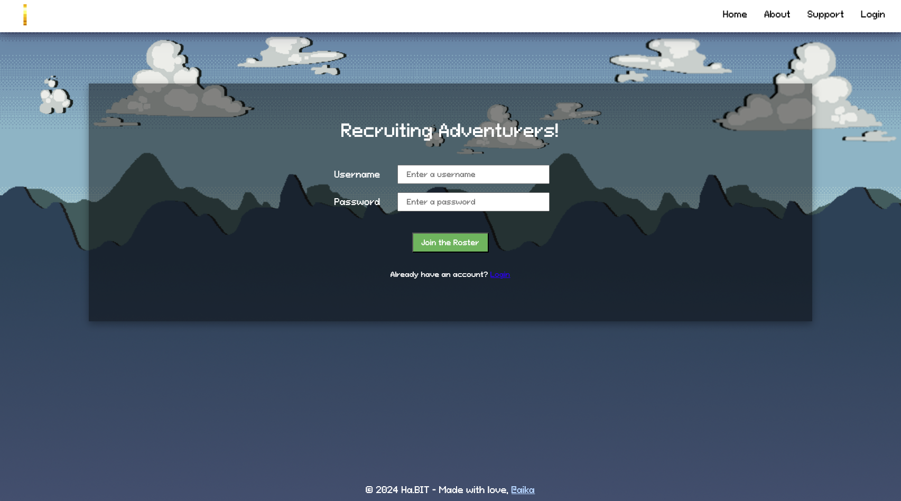

# Overview
Ha.BIT is a gamified productivity app designed to help users manage their tasks efficiently while having fun. By completing tasks and engaging with various levels, users earn coins that can be spent in the in-app shop to customize their characters.

## Problem
Many people struggle with productivity and task management due to a lack of motivation and engagement. Traditional to-do lists and productivity tools often fail to provide the necessary incentives to keep users on track. Ha.BIT addresses this pain point by incorporating gamification elements that make task management enjoyable and rewarding.

## User Profile
### Target Users

- Students: Need to manage assignments, study schedules, and extracurricular activities.
- Professionals: Juggling work tasks, personal projects, and daily errands.
- Gamers: Individuals who enjoy game-like elements in everyday activities.

### Usage Scenarios
- Task Management: Users can create, manage, and complete tasks using a to-do list.
- Gamification: Users engage with game levels that have timers; upon completion, they earn coins.
- Customization: Users spend earned coins in the shop to buy new characters and personalize their experience.

### Special Considerations
- User Engagement: Incorporate features that maintain long-term engagement, such as streaks and achievements.

## Features
- Game Animation: A game animation that users engage with while completing tasks.
- Levels with Timers: Different levels with varying timer lengths that users must complete to earn coins (+ 30 minutes each).
- Coin Rewards: Coins awarded upon task and level completion.
- Shop: A virtual shop where users can spend coins to purchase new characters.
- To-Do List: A feature to create, manage, and track tasks.
- Habit Tracker: A feature that allows you to add habits and allows you to visually track your progress.

## Sitemap
- Home Page: Introduction to Ha.BIT with a features section.
- About Link: Information about the app's purpose and creators (links to github).
- Support Page: A page that has answers to the most possible common questions and FAQ.
- Dashboard: User's main interface to manage tasks, view coins, and access the shop.
- Sign Up Page: A sign up page that allows a user to make an account and access the features and functionalities of the app.
- Login Page: A login page.

# Installation
IMPORTANT: This is the front-end ONLY. For the backend API/server, please navigate to: https://github.com/notaika/Ha.BIT-API

On your terminal, run:
1. `npm install` 
    - (packages includes: vite, axios, dotenv, sass, react, react-router-dom, mui, react-timer-hook)
2. Ensure that you setup your environment variables in a .env file: 

3. For full functionality and experience, please follow the NOTE below instruction number 5 before running the server.

4.  `npm start`
5. Navigate to: http://localhost:5173/

NOTE: For full functionality (the habit tracker heatmap), please setup your PIXELA ACCOUNT and insert the required values in your .env file. Refer to .env.sample for the setup.

In Postman or your preferred API platform, please follow the instructions below:

1. Create your own pixel.a account: 
     
2. Insert your input values from "token" and "username" into the .env file.

    <i> For more detailed explanation on the pixel.a API and functionality, please refer to: https://docs.pixe.la/ & https://help.pixe.la/en </i>

3. Click on this link: https://cors-anywhere.herokuapp.com/corsdemo and please click on "Request temporary access to the demo server"

## Usage Instructions
1. ### Sign Up + Login
    - Sign Up: Create an account by providing your email, username, and password. Verify your email to activate the account.
    - Login: Enter your username and password to access your account.

2. ### Expeditions
    #### Claim Your First Character:
    - Upon first logging in, claim your free character - the soldier.
    - Navigate to the 'Characters' section to view and select your character.
    #### Choose an Adventurer:
    - Select an adventurer to deploy on expeditions.
    #### Level Selector:
    - Choose a level with an increasing timer length designed for focused work. Higher levels have longer timers.
    - Higher levels yield more rewards (coins).
    #### Start Timer:
    - Begin the timer when you are ready to focus.
    - Work until the timer ends.
    - Claim rewards (coins) at the end of the timer.

3. ### Side Quests (To-Do List)
    #### Track Tasks:
    - Add tasks to the to-do list to keep track of what you need to accomplish while the timer is running.
    #### Organization:
     - Use this feature to stay organized and manage your tasks effectively.
    - <i> Note: There are no rewards for completing these tasks. </i>

4. ### Clock
    #### Clock Display:
    - View the current time while working.
    #### Random Quotes:
    - Enjoy cute, randomly generated quotes to keep you motivated throughout your session.

5. ### Daily Quests (Habit Tracker)
    #### Add Habit:
    - Add new habits to track daily activities.
    #### Complete Habits:
    - Complete habits once a day to maintain a streak and track your progress.
    - Habits reset at 1 AM UTC.
    #### Track Habit Feature:
    - If you set up your own Pixela account, use the track habit feature to visualize your progress with more insights on a heatmap.

6. ### Game Window
    #### Character vs. Monsters:
    - Watch animations of your character battling different monsters.
    - Enjoy the visual representation of your progress and achievements.

By following these detailed instructions, you will be able to make the most out of Ha.BIT, ensuring an organized, productive, and enjoyable experience.
# Implementation
## Tech Stack
### Front-End:
- HTML
- CSS (Sass)
- Axios

### Back-End:
- Javascript
- React.js
- Express
- Node.js
- MySQL + Knex.js
- JWT/bycryptjs for authentication

## APIs
- Random Game Quotes API
- pixel.a API

## Screenshots
### Home Page:
  

### Sign Up Page: 
  

### Login Page: 
  

### Support Page: 
  

### Dashboard page: 
  

### Habit Tracker Modal: 
  

# Lessons Learned

- How to do authentication and authorization and how useful it is in passing down props through middleware (opening up a bunch of features for me).

- Using pixel.a API and how to pass and setup data to pass through API calls.

- New DSA's, logic and methods

- Merging tables together within the database

- Looking back at how I started this project to vs. how I finished it now, it was an extremely rewarding experience. When I first started to code, I winged it on the spot - whatever popped up in my head and I thought had to happen I wrote it down in straight into VSCode. Once I was putting all of the components together - I realized that they don't mash together or fit. A lot of mistakes were made, such as making too many tables on my database, having to alter the data types, needing to separate components and lift up states, etc. One of the biggest lessons I learned and really helped me along the way was truly planning it out and mapping it before writing it down onto code. I wasted a week of work due to debugging and fixing afterwards. A lot of the tasks was extremely overwhelming because I just didn't know what to do and how to write it down until I sat down and mapped it out step-by-step. I realized I knew more than I thought.

- I also realized that there was so much more to learn. Challenging myself to do these features, having to learn to learn new packages or data structures and having it all piece together was rewarding. I always thought when doing leetcode/codewar questions, "When do I really need to use this DSA?" - it showed when doing this project.

- Documenting my process allowed me to see a lot of things about my project in a whole different perspective.  

Example:  

# Next Steps
- Responsive Design for mobile and tablet
- Expand the shop, make the characters have you farm more coins rather than being cosmetic upgrades; add weapons with stats that help users farm more coins for more motivation
- Have a "focus together" implementation with other users and friends and earn rewards + go adventure together
- Have more monsters, characters and sprites (partner with a designer!)
- More in the future!

# Credits:
- All images and sprites used were either from Unsplash or bought/listed for free from https://itch.io/game-assets/free
- https://saurabhkgp.itch.io/pixel-art-forest-background-simple-seamless-parallax-ready-for-2d-platformer-s
- https://zerie.itch.io/tiny-rpg-character-asset-pack
- Besides that, none of the images used are mine. If I overlook crediting someone - I do not claim any of the artwork as mine and should go to their rightful owners. Images used are for development purposes only and not for deployment.